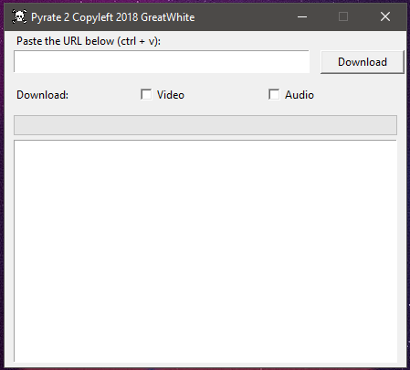

# Pyrate 2

Youtube downloader built atop Pafy and Tk

</img>

Currently Windows only. Might work with other platforms as well after some modifications.

## Install
0. Make sure Python is installed on your system.

1. Clone the source onto your harddrive by using `git` or the `clone or download` button and then  `Download ZIP`.

3. Right click `install.bat` and choose  `run as administrator`

4. Its done.

## How to use
Paste the link of the youtube video with `ctrl+v`, choose either audio or video and click `Download`

## It doesn't work
Open an issue describing your problem.

